

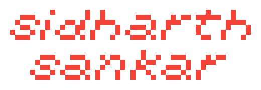

<h2>Projects</h2>
<h3>2025</h3>
<table>
	<tr>
		<td align="center" width="50%">
			  <b>Jan – <a href="https://github.com/sidstuff/webtrust-extension">webtrust-extension</a></b>  A decentralized Web of Trust implementation.       
		</td>
		<td align="center" width="50%">
			<a href="https://github.com/sidstuff/ULGL">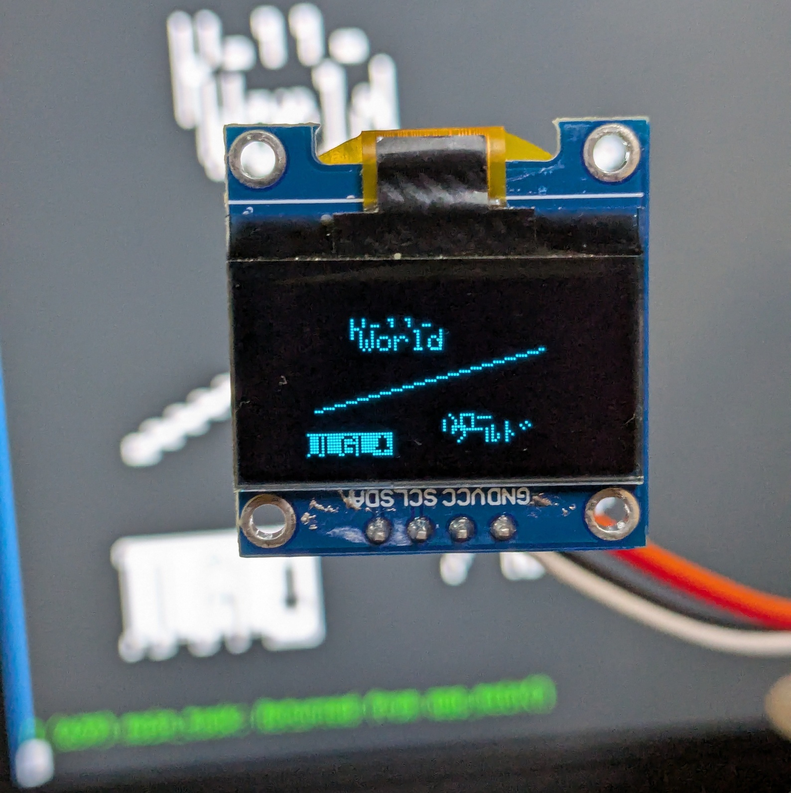</a>  <b>Feb – <a href="https://github.com/sidstuff/ULGL">ULGL</a></b>  Ultra Lightweight Graphics Library for monochrome OLED displays.    
		</td>
	</tr>
		<td align="center" width="50%">
			<a href="https://github.com/sidstuff/ninchan">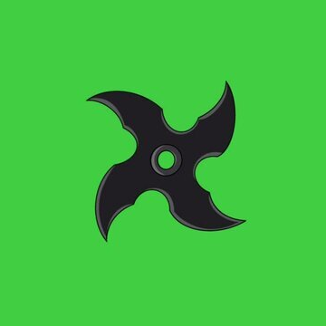</a>  <b>Mar – <a href="https://github.com/sidstuff/ninchan">ninchan</a></b>  An anonymous message board with Google Forms as a backend, that can be hosted as a static site.      						
		</td>
		<td align="center" width="50%">
			  <b>Apr – <a href="https://github.com/sidstuff/gentoo-installer">gentoo-installer</a></b>  TUI Gentoo installer.    
		</td>
	</tr>
	<tr align="center">
		<td align="center" width="50%">
			  <b>May – <a href="https://github.com/sidstuff/phenotypes">phenotypes</a></b>  Find which of the anthropological types from <i>Human Phenotypes</i> are your closest match using a single selfie.       
		</td>
		<td align="center" width="50%">
			  <b>Jul – <a href="https://github.com/sidstuff/bits">bits</a></b>  Automate the BITS Pilani Wi-Fi connection and login on Linux.     
		</td>
	</tr>
	<tr align="center">
		<td align="center" width="50%">
			  <b>Oct – <a href="https://github.com/sidstuff/setup">setup</a></b>  My Debian/Ubuntu setup script.     
		</td>
		<td align="center" width="50%">
			  <b>Nov – <a href="https://github.com/sidstuff/sflc-boot">sflc-boot</a></b>  A custom initramfs to boot into a hidden OS on a Shufflecake-formatted partition.    
		</td>
	</tr>
</table>
<h3>2024</h3>
<table>
	<tr>
		<td align="center" width="50%">
			<a href="https://github.com/sidstuff/orbital">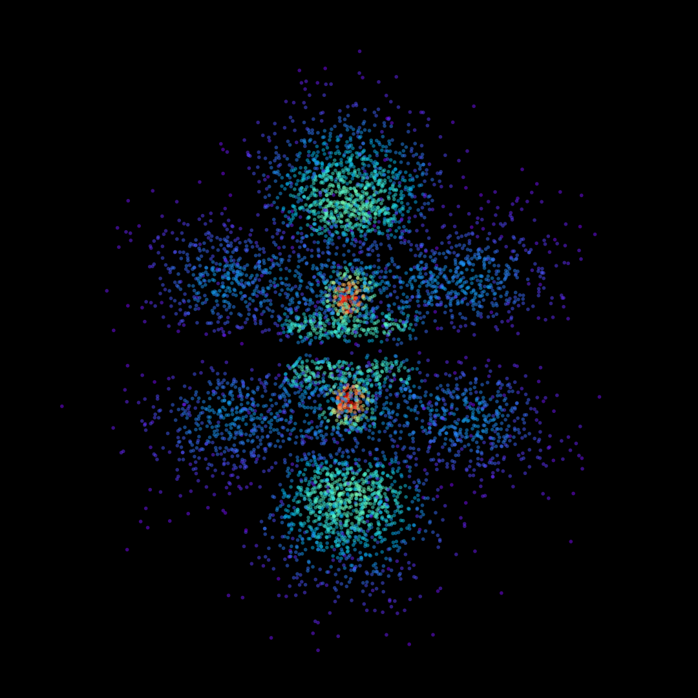</a>  <b>Mar – <a href="https://github.com/sidstuff/orbital">orbital</a></b>  Make interactive scatterplots of atomic orbitals and animate them.     
		</td>
		<td align="center" width="50%">
			<a href="https://github.com/sidstuff/moire">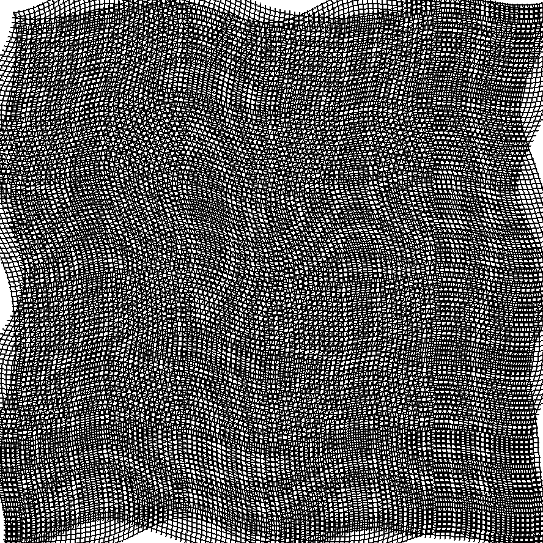</a>  <b>Mar – <a href="https://github.com/sidstuff/moire">moire</a></b></a>  Using the Python Imaging Library (PIL, now Pillow) to generate colors and animate Moiré patterns.    
		</td>
	</tr>
	<tr>
		<td align="center" width="50%">
			<a href="https://github.com/sidstuff/bf-repl">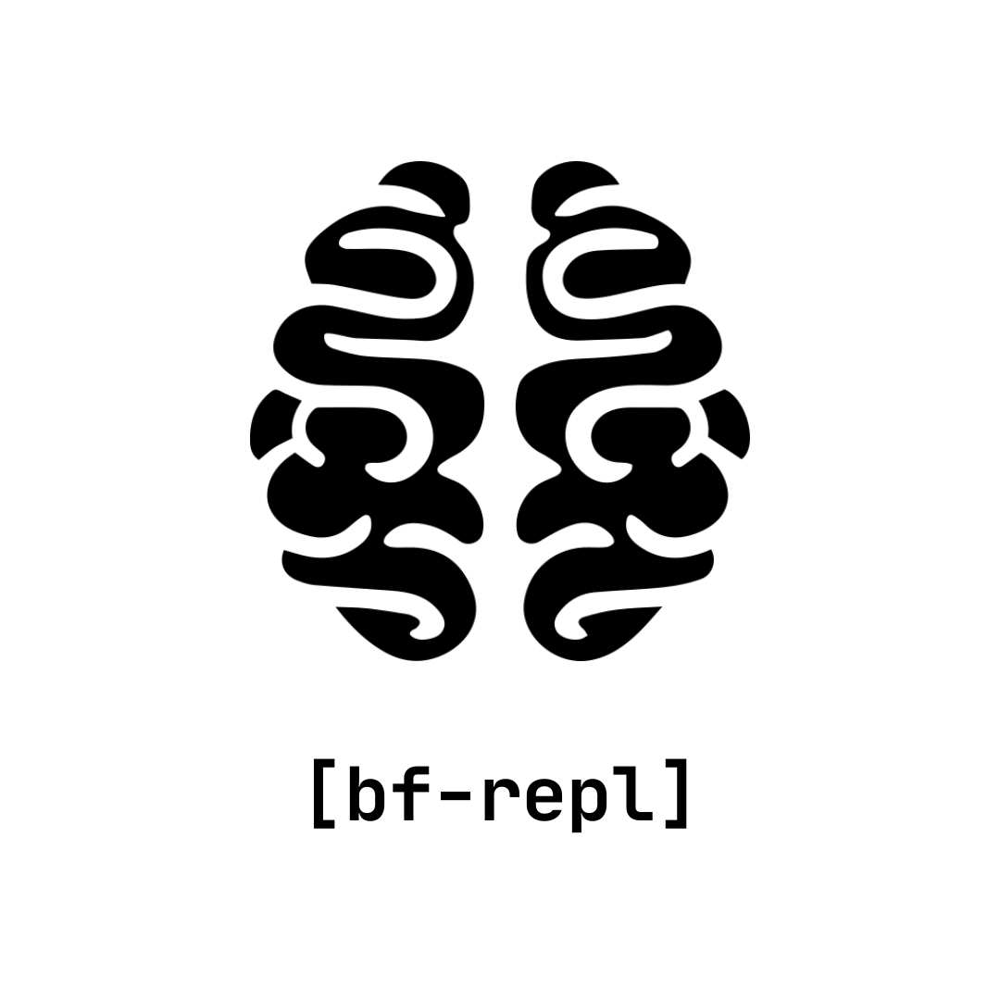</a>  <b>Apr – <a href="https://github.com/sidstuff/bf-repl">bf-repl</a></b>  A Brainfuck interpreter with a REPL, written in x86-64 NASM assembly for Linux.    
		</td>
		<td align="center" width="50%">
			<a href="https://github.com/sidstuff/learnasm">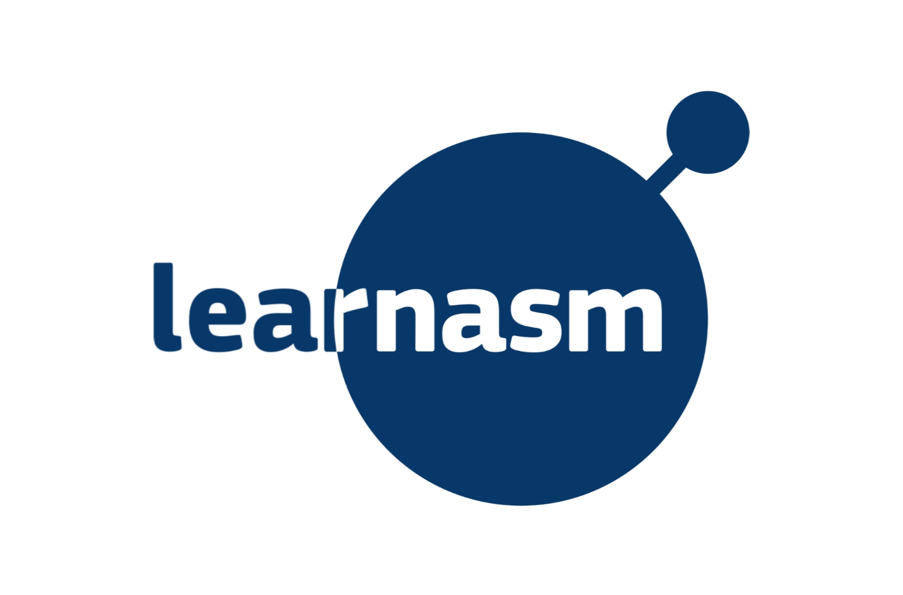</a>  <b>Apr – <a href="https://github.com/sidstuff/learnasm">learnasm</a></b>  Learn x86-64 Assembly building a Brainfuck interpreter.    
		</td>
	</tr>
	<tr>
		<td align="center" width="50%">
			<a href="https://github.com/sidstuff/cutoffs">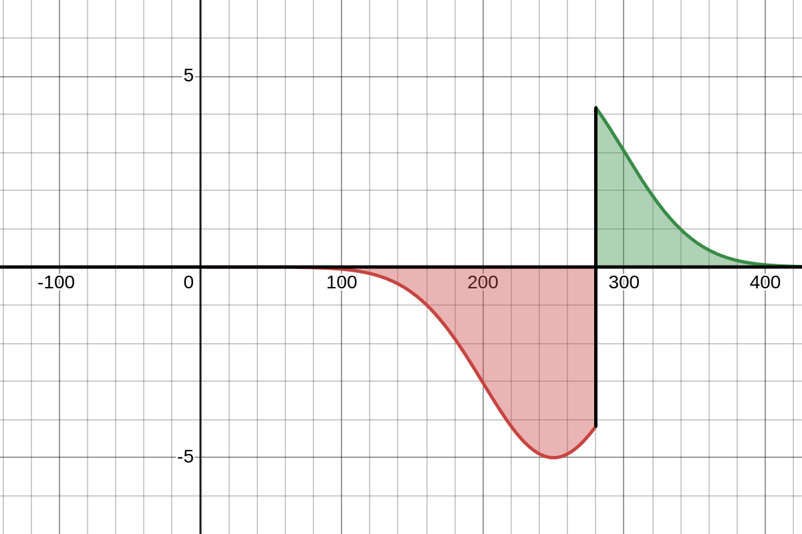</a>  <b>Jul – <a href="https://github.com/sidstuff/cutoffs">cutoffs</a></b>  Spam-resistant crowdsourcing of accurate cut-off scores.    
		</td>
		<td align="center" width="50%">
			<a href="https://github.com/sidstuff/robot">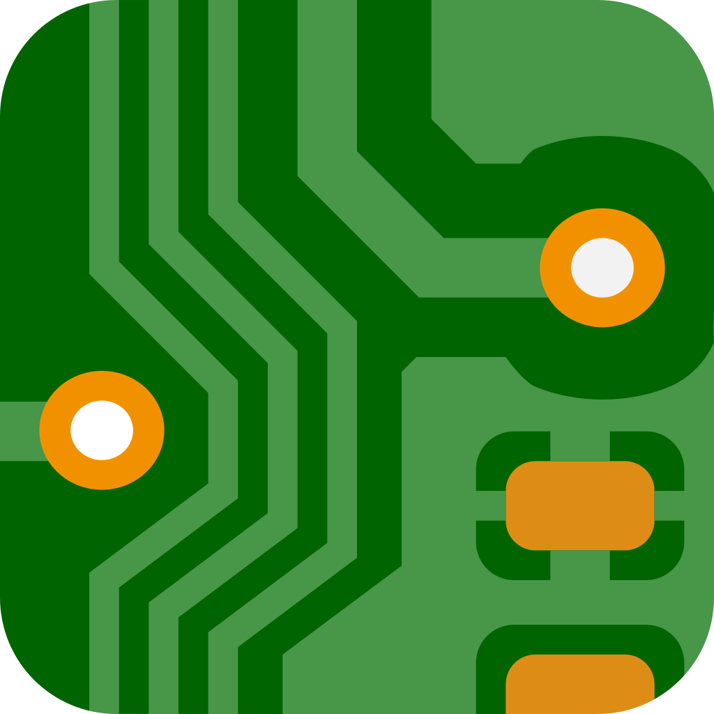</a>  <b>Sep – <a href="https://github.com/sidstuff/robot">robot</a></b>  A KiCad PCB for an obstacle avoiding robot.    
		</td>
	</tr>
	<tr>
		<td align="center" width="50%">
			  <b>Oct – <a href="https://github.com/sidstuff/crypto">crypto</a></b>  OpenSSL cryptography tutorial + simple RSA implementation in C.    
		</td>
		<td align="center" width="50%">
			  <b>Nov – <a href="https://github.com/sidstuff/nixos">nixos</a></b>  My NixOS configuration. [In progress]    
		</td>
	</tr>
</table>

<h1><a href="https://github.com/ourbigbook/ourbigbook/commits?author=sidstuff">Contributed</a> to <a href="https://github.com/ourbigbook/ourbigbook"> OurBigBook</a> <a href="https://www.gnu.org/licenses/agpl-3.0.txt">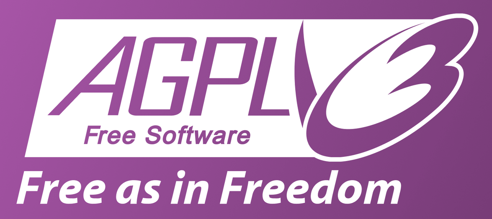</a></h1>
<a href="https://ourbigbook.com">ourbigbook.com</a> source code + a compatible local CLI static wiki generator and markup language to write complex structured wikis/books/blogs with reference implementation in JavaScript.

<h2>Bonus project (not by me)</h2>
<h3><a href="https://github.com/sidstuff/torch">Torch</a></h3>
  
Bash script found on <a href="https://matrix.to/#/#tor:matrix.org">#tor:matrix.org</a> for a Tor chat server.  
<a href="https://github.com/sidstuff/crypto">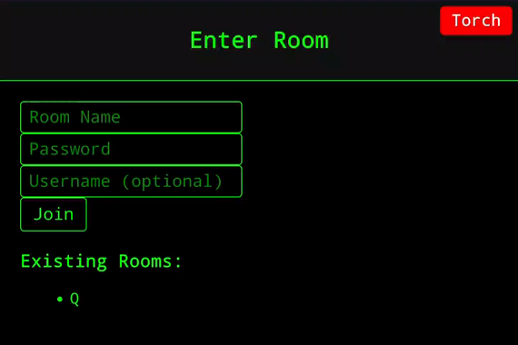</a>  
Wasn't published anywhere (else) on the searchable web and the anonymous creator has said they will not be developing it any further, so I decided to clone it here.  
    

