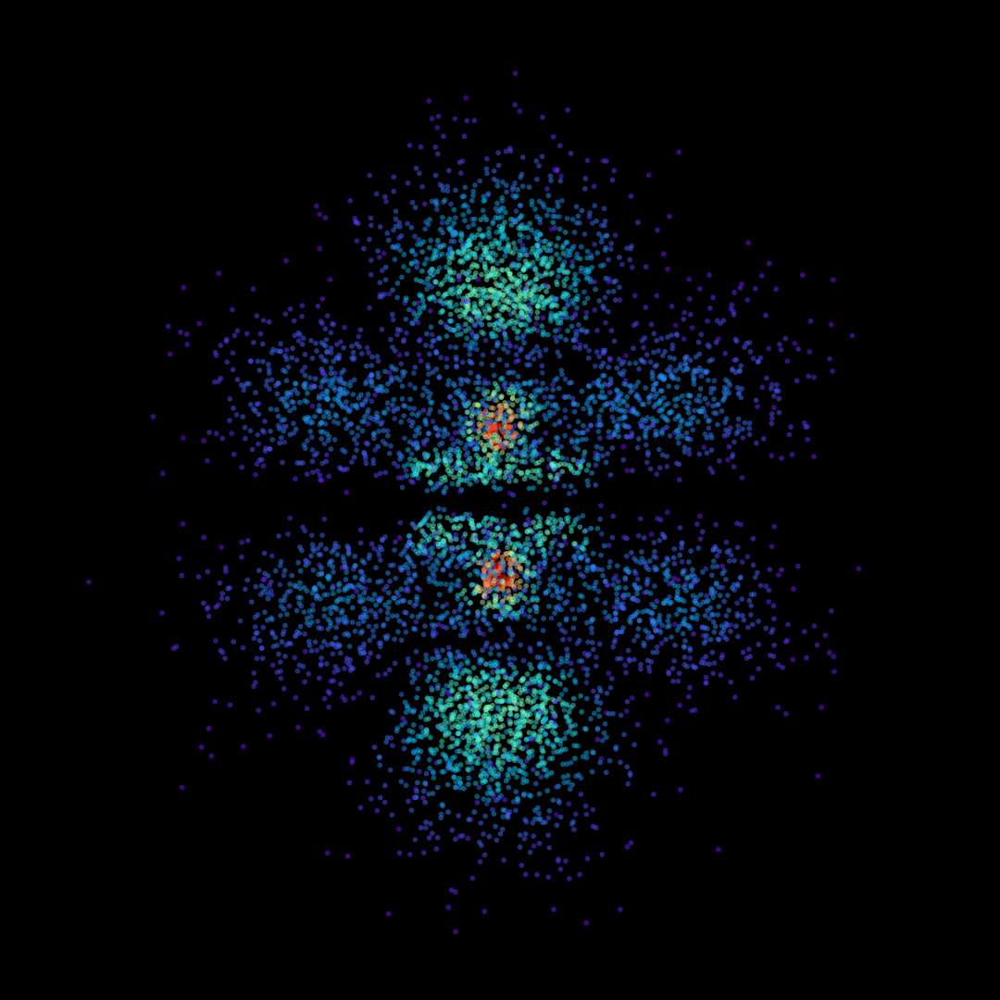
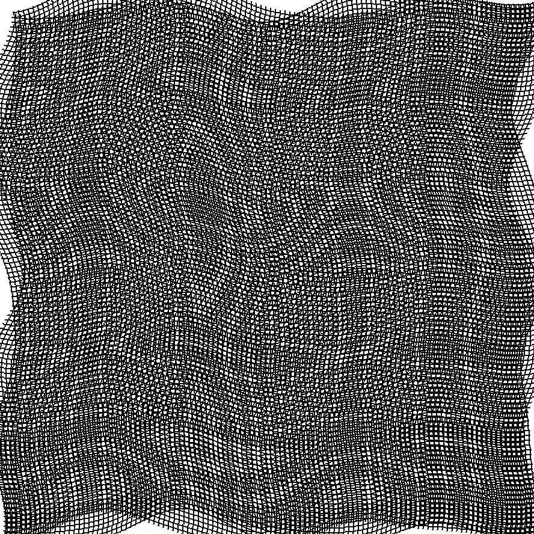
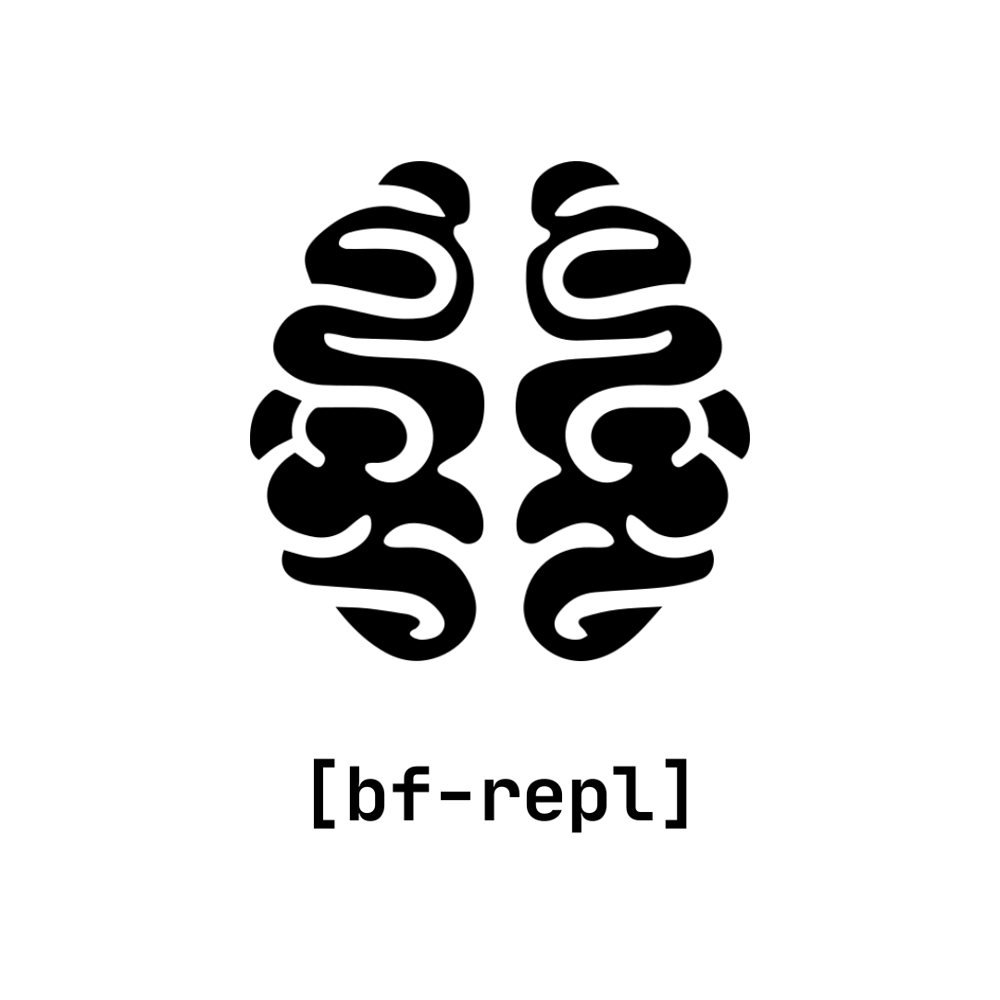
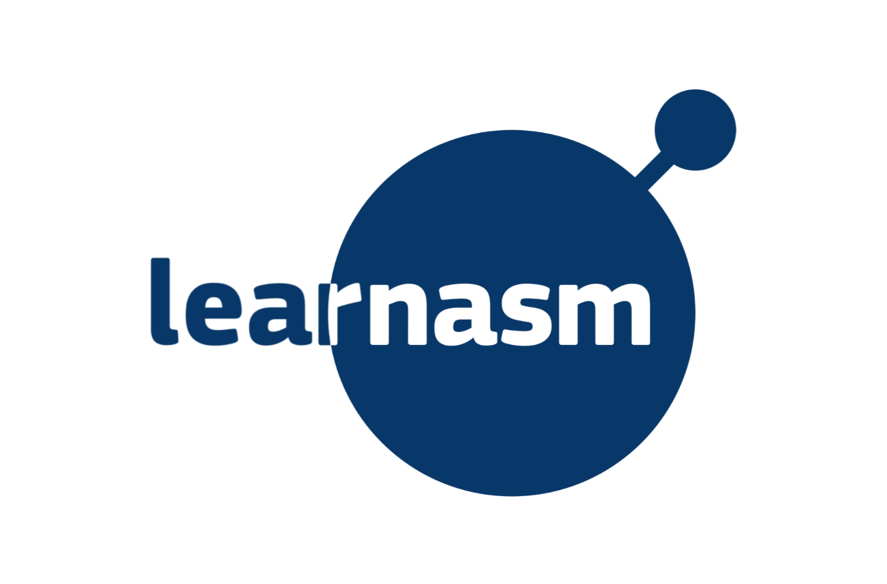
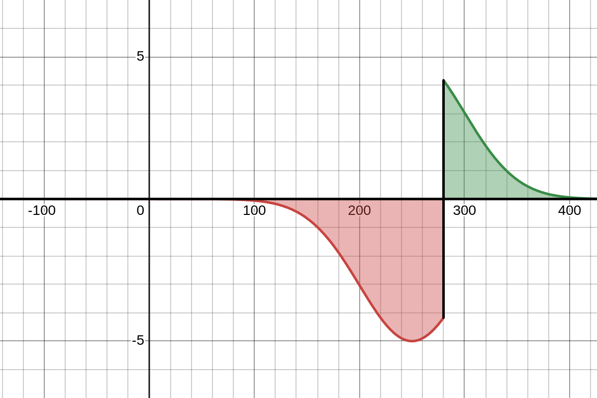
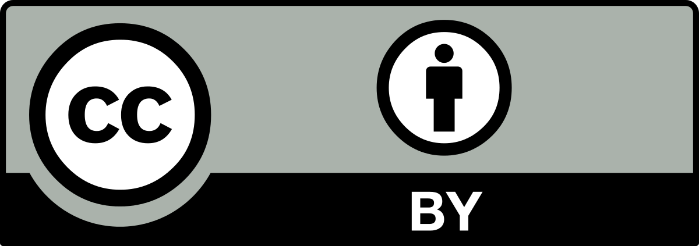
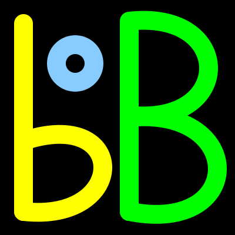
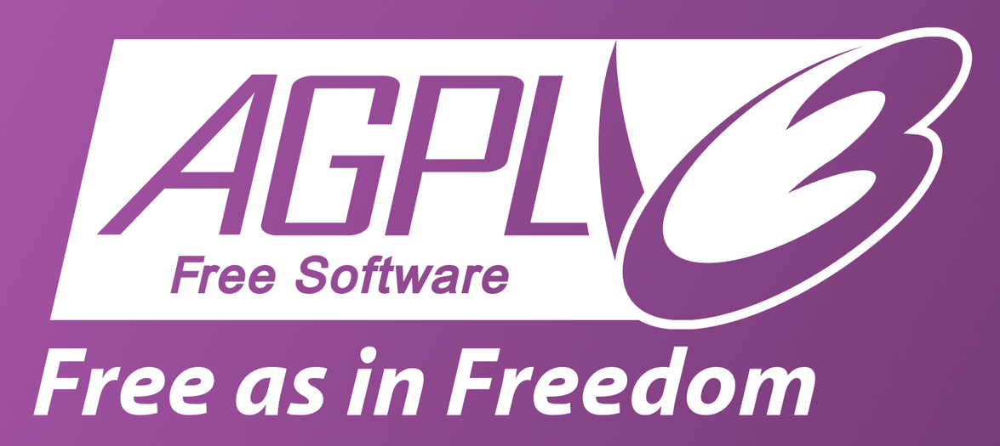

$${\huge\textsf{My\ Projects}}$$

 

<table>
	<tr>
		<td align="center" width="50%">
			<a href="https://github.com/sidstuff/orbital">  <b>orbital</b></a>  Make interactive scatterplots of atomic orbitals and animate them.  
		</td>
		<td align="center" width="50%">
			<a href="https://github.com/sidstuff/moire">  <b>moire</b></a>  Using the Python Imaging Library (PIL, now Pillow) to generate colors and animate Moiré patterns.  
		</td>
	</tr>
	<tr>
		<td align="center" width="50%">
			<a href="https://github.com/sidstuff/bf-repl">  <b>bf-repl</b></a>  A Brainfuck interpreter with a REPL, written in x86-64 NASM assembly for Linux.  
		</td>
		<td align="center" width="50%">
			<a href="https://github.com/sidstuff/learnasm">  <b>learnasm</b></a>  Learn x86-64 Assembly building a Brainfuck interpreter.  
		</td>
	</tr>
	<tr>
		<td align="center" width="50%">
			<a href="https://github.com/sidstuff/cutoffs">  <b>cutoffs</b></a>  Spam-resistant crowdsourcing of accurate cut-off scores.  
		</td>
		<td align="center" width="50%">
			<a href="https://github.com/sidstuff/robot">  <b>robot</b></a>  A PCB for an obstacle avoiding robot.  
		</td>
	</tr>
</table>

 
<a href="https://creativecommons.org/licenses/by/4.0/legalcode.txt"> CC BY 4.0</a>

<table><tr><td align="center">
	<a href="https://github.com/libertarian-faq">  <b>@libertarian-faq</b></a>  Explanation and watertight defense of libertarianism for libertarians as well as non-libertarians.  
</td></tr></table> 

<h1><a href="https://github.com/ourbigbook/ourbigbook/commits?author=sidstuff">Contributed</a> to <a href="https://github.com/ourbigbook/ourbigbook"> OurBigBook</a> </h1>
<a href="https://ourbigbook.com">ourbigbook.com</a> source code + a compatible local CLI static wiki generator and markup language to write complex structured wikis/books/blogs with reference implementation in JavaScript.
